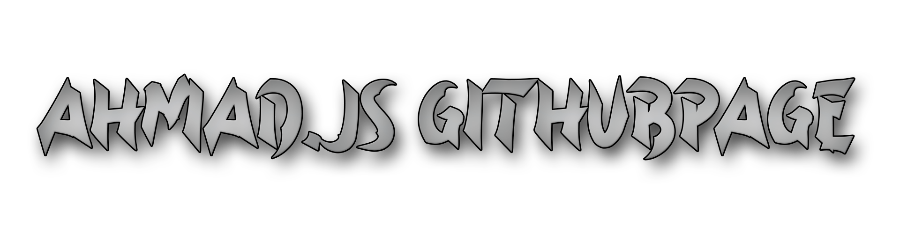

<a>
  
</a>

```js
<Who am I?>
Here is a little introduction about me
```
- 🌱 I'm working with discord.js and express.js wich both use node.js
- 💎 I make open source projects
- ⚡ Fun fact: I'am a Moderator in CodingSchool: https://discord.gg/FSCrkqKFvz

### Languages and Tools:

- Main IDE that i use </br>
- Most of my work is about this library </br>
- Obv the Language that is needed for node.js </br>
- Discord.js and express.js wouldn't work without this </br>


