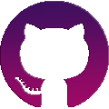
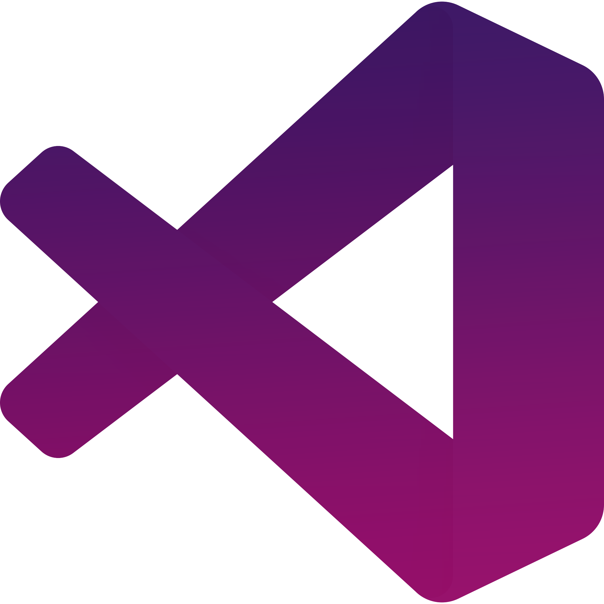

  
  <h2>Social Links</h2>
    
    
    
   
    
  <h2>Hey I'm Ahmad. Wolcome to my Github Page 🙂</h2>
    

   
  
 
    I'm a 18 Years old male from Germany
    I work around a lot in Fullstack Web and Discord Bot Development 
    

  

    My main project at the moment is my own Discord Bot named <a href="https://aniguard.xyz">AniGuard</a> wich is sadly still in develeopment
    

  <h2>Languages and Tools</h2>
  

    Here are some Languages and Tools I use for my daily Development
  

   
  

